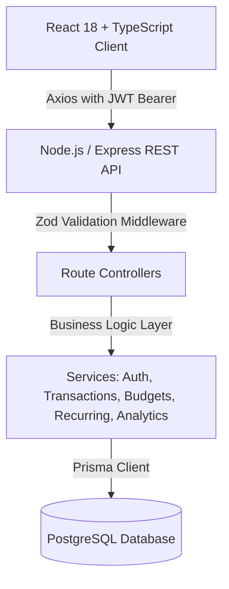

# FinTrack — Personal Finance & Analytics Platform

A production-grade, multi-tenant personal finance management and analytics platform built with React, TypeScript, Node.js, Express, PostgreSQL, and Prisma ORM.

---

## 🏛️ Architecture Overview



---

## 🛠️ Tech Stack

* **Frontend**: React 18, TypeScript, Tailwind CSS, Recharts, React Router v6, Axios, Lucide React
* **Backend**: Node.js, Express.js, TypeScript, Prisma ORM, Zod, bcryptjs, JSON Web Tokens
* **Database**: PostgreSQL 16
* **Tooling**: Vite, Docker Compose, tsx

---

## 🚀 Quick Start Guide

### 1. Prerequisites
- Node.js >= 18.x
- Docker & Docker Compose (or local PostgreSQL instance)

### 2. Install Dependencies

```bash
# Install root, server, and client packages
npm install
cd server && npm install
cd ../client && npm install
cd ..
```

### 3. Database Setup

Start the PostgreSQL 16 container:
```bash
docker compose up -d
```

Push the database schema and generate Prisma client:
```bash
cd server
npm run prisma:push
```

Seed 6 months of realistic historical financial data:
```bash
npm run seed
```

### 4. Start Development Servers

Run backend and frontend concurrently:
```bash
# In terminal 1 (Server - http://localhost:5000):
npm run dev:server

# In terminal 2 (Client - http://localhost:5173):
npm run dev:client
```

---

## 🔑 Demo Account Credentials

Click **"Fill Demo"** on the login screen, or sign in with:
* **Email**: `demo@fintrack.app`
* **Password**: `Password123!`

---

## 📋 REST API Reference

| Method | Endpoint | Description |
|---|---|---|
| `POST` | `/api/auth/register` | Register new user with auto-seeded categories |
| `POST` | `/api/auth/login` | Authenticate user and receive JWT |
| `GET` | `/api/auth/me` | Fetch authenticated user profile |
| `GET` | `/api/categories` | Retrieve user and system categories |
| `GET` | `/api/transactions` | Query ledger transactions with filters & pagination |
| `POST` | `/api/transactions` | Create income or expense entry |
| `PUT` | `/api/transactions/:id` | Update existing transaction |
| `DELETE`| `/api/transactions/:id`| Remove transaction |
| `GET` | `/api/budgets` | Fetch monthly category targets & real-time utilization |
| `POST` | `/api/budgets` | Create category budget |
| `GET` | `/api/recurring` | List recurring schedules |
| `POST` | `/api/recurring/process-due` | Convert due recurring bills to ledger transactions |
| `GET` | `/api/analytics/overview` | Aggregated balances, savings rate, largest entries |
| `GET` | `/api/analytics/spending-trend` | Daily cashflow time series points |
| `GET` | `/api/analytics/category-breakdown` | Category percentage distributions |
| `GET` | `/api/analytics/monthly-comparison`| 6-month historical monthly trends |
